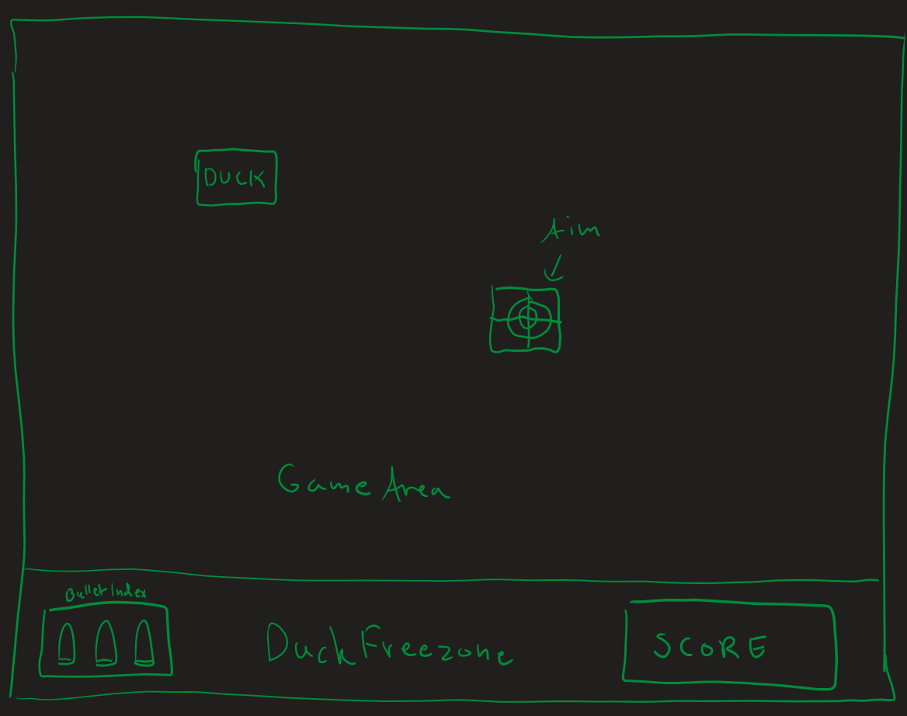

# Duck Hunt 

## Wireframes:

## Inspiration:

## Hva går spillet ut på, og hvordan fungerer det?
#### Dette spillet er en nyversjon av det klassiske retrospillet "Duck Hunt (NES)", opprinnelig utviklet av Nintendo i 1984. Målet er å jakte på ender med et gevær. Spilleren bruker tastene WASD for å bevege siktet, og tasten "H" for å skyte. Endene flyr ut fra et høyt gress i tilfeldige retninger, men kan ikke treffes når de er i gresset, kun når de er i luften. Hver gang en and treffes, får spilleren poeng. For hver and har spilleren tre skudd til rådighet. Hvis alle skuddene bommer, blir det game over. Endene flyr bort etter 5 sekunder, og en ny and dukker opp 3 sekunder senere. Etter at spilleren har skutt 10 ender, starter en ny runde, og endene flyr 0.5 enheter raskere for hver runde.

## Hvordan starte spillet?
#### 1. Åpne terminalen/ledetekst
#### 2. skriv: cd /your_file
#### 3. skriv: git clone "https://github.com/jonabarona/Recreated-Duck-Hunt---game.git"
#### 4. Når den er klonet, åpne filen, finn html koden
#### 5. dobbelklikk html filen kalt "index"
#### 6. Kos deg!

## Refleksjon
### Noen bugs?
#### En bug er at kollisjonen mellom and og sikte ikke er helt riktig. Andens "hitbox" er noen pixler opp. Derfor treffer man ikke alltid hvis man skyter på bunnen av anden

## Hva synes jeg?
#### Jeg synes dette har vært det morsomste prosjektet å jobbe med siden det var så fritt til å kunne lage hva jeg ville. Personlig vil jeg kalle dette en suksess. Det var ikke meningen å få alt 100% likt. Jeg har for eksempel endret på noe av funksjonaliteten til spillet.

## Hvis mer tid:
1. Hvis jeg hadde hatt mer tid, ville jeg lagt til den ikoniske "hunde maskotten", som man kan se på videoen. Dette hadde bare vært for det visuelle, og ikke for spillets funksjonalitet.
2. Jeg ville også ha lagt til lydeffekter til spillet. Slik som det er i det originale

## Lisens
#### Alle har lov til å bruke spillet, og bruke koden selv til ens eget behov. Dette gjelder å ta enkelte biter av koden, eller forandre/forbedre koden.

## Linker og Credits
### Video av orginale spillet:
[Video Link](https://youtu.be/J3sfsP9W048?si=ADbCoXGZ5kJ2p43a)

### Assets:
[Assets Link](https://www.spriters-resource.com/nes/duckhunt/)